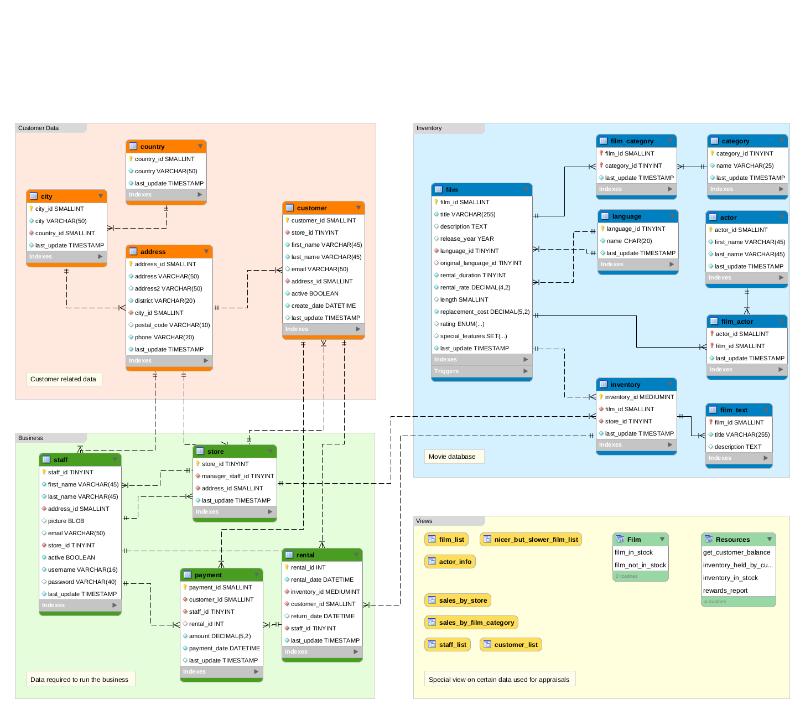

# MySQL Queries with Sakila Test Databass:

## i. DB ER diagram:

## ii. Setting Up Schema and Populate Database:

- **i. Setting UP schemas and Database:**

> ``tar -xf sakila-db.tar.gz -C <path>``

- **ii. Connect to the MySQL server:**

> ``mysql -u <username> -p``

- **iii. Create schema for sakila db**

``mysql> SOURCE <path>/sakila-db/sakila-schema.sql;``

- **iii. Populate database**

``mysql> SOURCE <path>/sakila-db/sakila-data.sql;``

## Practice Questions:

- Which actors have the first name ‘Scarlett’

- Which actors have the last name ‘Johansson’

- How many distinct actors last names are there?

- Which last names are not repeated?

- Which last names appear more than once?

- Which actor has appeared in the most films?

- Is ‘Academy Dinosaur’ available for rent from Store 1?

- Insert a record to represent Mary Smith renting ‘Academy Dinosaur’ from Mike Hillyer at Store 1 today .

- When is ‘Academy Dinosaur’ due?

- What is that average running time of all the films in the sakila DB?

- What is the average running time of films by category?

- Why does this query return the empty set?